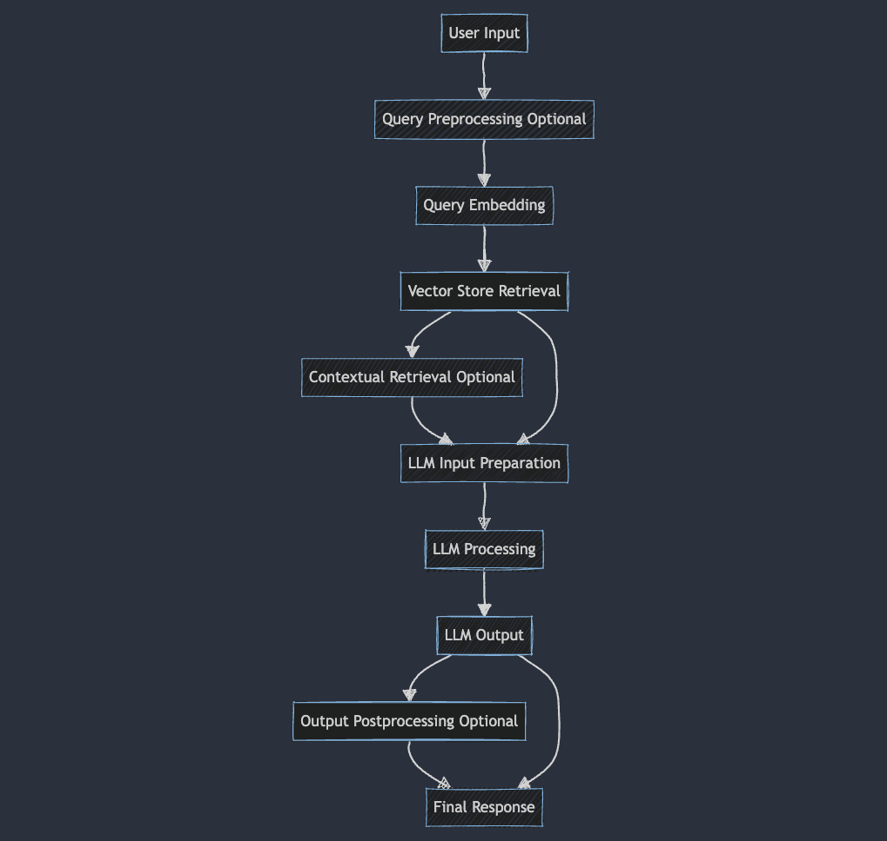

```mermaid
flowchart TD
    A[User Input] --> B[Query Preprocessing Optional]
    B --> C[Query Embedding]
    C --> D[Vector Store Retrieval]
    D --> E[Contextual Retrieval Optional]
    E --> F[LLM Input Preparation]
    D --> F[LLM Input Preparation]
    F --> G[LLM Processing]
    G --> H[LLM Output]
    H --> I[Output Postprocessing Optional]
    I --> J[Final Response]
    H --> J[Final Response]